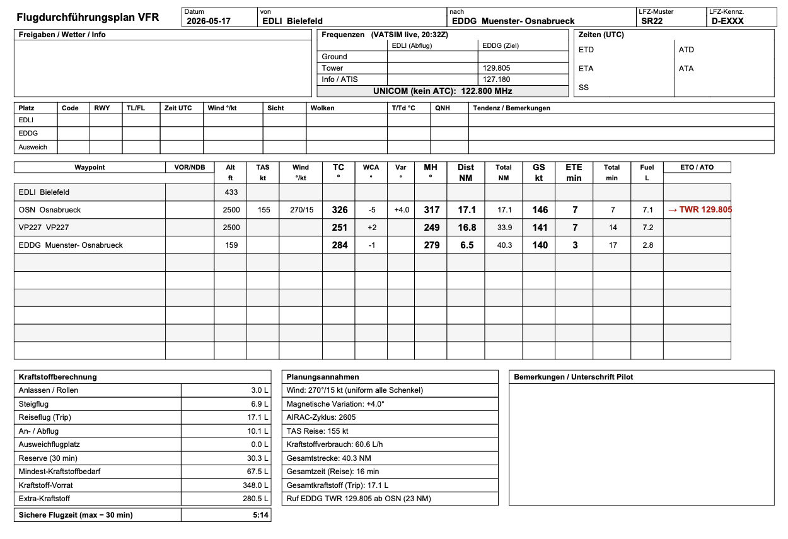

# vfr-navlog

A Python script that turns a VFR flight plan into a printable A4-landscape navlog PDF, German LBA-style. Built for simulator use with X-Plane 12 and VATSIM, but the output is real-world readable.

Two plan sources are supported:

- **[Navigraph Charts](https://navigraph.com/products/charts)** — the primary source. With `--navigraph`, the script reads the active plan directly out of Navigraph Charts' local storage on macOS. No export, no file — just plan and run.
- **[Little Navmap](https://www.littlenavmap.org/) `.lnmpln`** — pass the file with `--plan`. You can also plan in Navigraph Charts and export (File → Export → Little Navmap) to get this format.



## Output

Five core pages, plus optional DFS airport chart pages appended at the end:

1. **Navlog** — header strip, frequency block with live VATSIM frequencies (GND/TWR/ATIS/DEL/APP + en-route radar), ATIS strip, leg-by-leg table (TC / MH / dist / GS / ETE / fuel), fuel summary, planning assumptions, tower-call marker.
2. **FIS / Radar phraseology** — bilingual (DE/EN) dialogue cheat-sheet for the en-route FIS or radar contact. Adapts automatically: when Langen / Bremen / München Radar is online on VATSIM, the page title, note, and squawk guidance update to reflect radar service rather than basic FIS.
3. **CTR phraseology** — the full inbound sequence at the destination: initial tower call, full position report with ATIS letter, CTR entry clearance via Whiskey, Whiskey call, downwind join, landing clearance, runway vacated, taxi to GA apron. Variations table covers holds outside the CTR, squawk assignments, and traffic sequencing.
4. **Destination briefing** — airport data (elevation, TA/TL, IATA), runway table with ILS LOC frequencies from X-Plane's `earth_nav.dat`, communication frequencies, live VATSIM ATIS text.
5. **Weather briefing** — two-column METAR + TAF for departure and destination (via VATSIM weather proxy), parsed key values (wind, visibility, ceiling, QNH, phenomena), VFR / MVFR / IFR go/no-go assessment table, en-route radar banner.

## Install

Python 3.10+ and the required packages:

```
pip install fpdf2 requests img2pdf Pillow
```

On macOS the script registers `Arial.ttf` from `/System/Library/Fonts/Supplemental/` so umlauts render. On other platforms it falls back to core Helvetica.

### Navigraph Charts source (macOS only)

To read the active plan directly from Navigraph Charts, clone the Chromium local-storage reader next to `navlog.py`:

```
pip install brotli
pip install 'ccl_simplesnappy @ git+https://github.com/cclgroupltd/ccl_simplesnappy.git'
git clone --depth 1 https://github.com/cclgroupltd/ccl_chromium_reader.git
```

## Interactive mode

```
python3 navlog.py
```

The wizard asks for:

1. Plan source — `.lnmpln` file or Navigraph Charts live read
2. Aircraft JSON
3. Registration (defaults to JSON value, overridable)
4. Wind aloft — `DDD/SS` or press `M` to fetch the surface METAR from VATSIM
5. Cruise altitude in ft MSL
6. Magnetic variation
7. Whether to fetch live VATSIM data (ATC frequencies + weather)
8. Whether to add a VOR reference per waypoint — if yes, it walks every waypoint and asks for free text (e.g. `233 FROM`), which prints in the navlog's VOR column. Press Enter to leave a waypoint blank.
9. Whether to append DFS VFR charts for the destination
10. Whether to write an X-Plane FMS file
11. Whether to generate an ICAO FPL for VATSIM prefile — asks for EOBT, POB, equipment code, wake category, alternate, and pilot name, then opens `my.vatsim.net/pilots/flightplan/beta` pre-filled in your browser

## CLI

```
python3 navlog.py \
    --plan "VFR Bielefeld to Muenster.lnmpln" \
    --aircraft aircraft_c172.json \
    --wind 270/15 \
    --magvar 4E \
    --cruise-alt 2500 \
    --vatsim \
    --dfs-charts \
    --fms \
    --fpl-eobt 1030 \
    --fpl-pob 2 \
    --output navlog.pdf
```

### Flags

| Flag | Default | Notes |
|------|---------|-------|
| `--plan` | — | Little Navmap `.lnmpln` file. Mutually exclusive with `--navigraph`. |
| `--navigraph` | off | Read the active plan live from Navigraph Charts (macOS). |
| `--aircraft` | required | JSON profile (see `aircraft_c172.json`). |
| `--registration` | from JSON | Override the aircraft registration for this run. |
| `--wind` | `0/0` | Wind aloft `DDD/SS`, e.g. `270/15`. Applied uniformly to every leg. |
| `--cruise-alt` | from plan | Override cruise altitude (feet MSL). |
| `--magvar` | `4E` | Magnetic variation. `4E`, `-3.5`, `2.5W` all work. |
| `--output` | auto | Output path. Defaults to `<dep>-<dest>/navlog_<date>_<type>.pdf`. |
| `--vatsim` | off | Fetch live VATSIM data: ATC frequencies, en-route radar, METAR/TAF. |
| `--dfs-charts` | off | Append VFR charts for the destination from the official DFS AIP. |
| `--vor-info` | off | Prompt for a free-text VOR reference (e.g. `233 FROM`) per waypoint; prints in the VOR column. |
| `--fms` | off | Write an X-Plane FMS v3 flight plan to `Output/FMS plans/`. |
| `--call-tower-nm` | `10` | NM remaining threshold for the tower-call leg marker. `0` disables. |
| `--xplane` | macOS Steam default | X-Plane 12 root. Pass `--xplane ""` to skip the destination-briefing page. |
| `--fpl-eobt` | — | Generate an ICAO FPL with this EOBT (HHMM UTC). Triggers FPL output. |
| `--fpl-pob` | `2` | Persons on board. |
| `--fpl-equipment` | `SDFG/C` | ICAO field 10 equipment/surveillance code. |
| `--fpl-wake` | `L` | Wake turbulence category (L / M / H / J). |
| `--fpl-alternate` | — | Alternate aerodrome ICAO. |
| `--fpl-pilot` | — | Pilot surname for FPL field 19C. |

## DFS airport charts

`dfs_charts.py` downloads VFR charts for any German airport from the official [DFS AIP](https://aip.dfs.de/) (Deutsche Flugsicherung), always at the current AIRAC cycle. No account or subscription needed.

```
python3 dfs_charts.py EDDV
python3 dfs_charts.py EDLI --no-ifr-aerodrome
python3 dfs_charts.py EDDV --out /tmp/charts
```

For each airport it fetches:

- **BasicVFR section** — VFR approach and area charts (the CTR entry/exit procedures, local traffic patterns, VFR routes into the airport)
- **BasicIFR aerodrome charts** — aerodrome chart (ICAO 2-5), ground movement charts (2-7, 2-7A), parking/docking chart (2-9), taxi restrictions (2-9A)

Output: individually numbered PNGs in `<ICAO>/` plus a combined `<ICAO>/<ICAO>_vfr_charts.pdf`.

When `--dfs-charts` is set (or selected in the TUI), `navlog.py` calls this logic internally and appends the chart pages to the navlog PDF. Each chart gets its own page, oriented portrait or landscape to match the source image.

The chart data comes from `aip.aero` as the AIRAC-cycle discovery index and `aip.dfs.de` for the actual pages. Both are public. Charts are embedded as PNG in DFS's HTML — the script extracts and reassembles them; there are no PDF originals to download.

## VATSIM integration

When `--vatsim` is set, the script makes three types of requests:

**ATC frequencies** — single GET against `https://data.vatsim.net/v3/vatsim-data.json`. Callsigns of the form `<ICAO>_GND`, `_TWR`, `_ATIS`, `_DEL`, `_APP`, `_CTR` are matched; split sectors (`EDDG_N_TWR`) handled by suffix. Frequencies populate the navlog's frequency block and the tower-call marker.

**En-route radar** — the script detects which German FIR the route overflies (EDGG Langen, EDWW Bremen, EDMM München) from waypoint latitudes and looks for online CTR stations. If Langen Radar is online, its frequency appears in a dedicated row in the frequency block (highlighted in blue) and the phraseology page 2 title and note update to reflect radar service, including the correct squawk guidance.

**Weather** — METAR and TAF for departure and destination via `metar.vatsim.net`. Results appear on the weather briefing page (page 5) with parsed wind, visibility, ceiling, temperature, QNH, and a VFR / MVFR / IFR assessment. Neither page is generated nor any request is made if `--vatsim` is off.

All network calls fail soft — if a request times out or returns an error, the corresponding cells stay blank and the script continues.

## ICAO FPL export

The script generates an ICAO ATS message ready for import into `my.vatsim.net/pilots/flightplan/beta`:

```
(FPL-DEXXX-VG
-C172/L-SDFG/C
-EDLI1030
-N0107A025 DCT OSN DCT
-EDDG0022 EDLP
-DOF/260529 REG/DEXXX
-E/0602 P/002 R/UV S/- J/-)
```

Key points:
- Altitude is ICAO `Axxx` format (hundreds of feet) — `A025` for 2500 ft. `VFR` as a level token is not accepted by the parser.
- Coordinate waypoints (e.g. `521430N0075330E` from user-defined points) are stripped from the route; only named fixes are kept.
- Aircraft type uses the `icao_type` field from the aircraft JSON when present (e.g. `C172`, not `C172S` which is the model name, not the Doc 8643 designator).
- On macOS, the script builds the pre-fill URL and opens `my.vatsim.net/pilots/flightplan/beta?raw=…` directly in your browser. The form arrives ready to file.
- The `.fpl` file is also saved next to the PDF.

## Aircraft profile

Edit `aircraft_c172.json` or write your own. The script reads:

| Field | Purpose |
|-------|---------|
| `type` | Displayed in the PDF header and phraseology pages |
| `icao_type` | ICAO Doc 8643 designator used in the FPL (overrides `type`). Set when the two differ, e.g. `C172S` → `C172`. |
| `registration` | Default registration; overridable via `--registration` or TUI |
| `performance.tas_cruise` | kt — navlog math |
| `performance.fuel_burn_cruise_lph` | cruise burn for fuel summary and endurance |
| `performance.fuel_burn_climb_lph` | climb burn |
| `performance.fuel_burn_taxi_lph` | taxi burn |
| `fuel.capacity_usable_l` | usable fuel for endurance calculation |
| `fuel.reserve_minutes` | reserve bucket |
| `fuel.taxi_minutes` | taxi bucket |
| `fuel.approach_minutes` | approach/circuit bucket |
| `fuel.alternate_minutes` | alternate bucket (0 = none planned) |

`mass_balance` is parsed but not yet rendered — present for future W&B expansion.

The bundled `aircraft_c172.json` uses Cessna 172S POH-typical numbers at 65% power. **Verify against your aircraft's POH before flying.**

## Phraseology pages

Both pages are templated to the registration, aircraft type, departure, and destination from the plan.

**Page 2 — FIS / en-route Radar.** When `--vatsim` is active and a radar station is online (e.g. Langen Radar), the page title shows the station name and live frequency, and the note box explains radar service semantics — squawk as instructed, separation is possible. When no radar is online it falls back to the standard Bremen Information FIS dialogue (Erstanruf, Vollmeldung, squawk 7000 on departure, workload denial and no-radar-contact variations).

**Page 3 — CTR entry via Whiskey.** EDDG-specific. The reporting-point name "Whiskey" and the assumed entry runway must be verified against current charts before each flight. The tower frequency in the subtitle is populated live from VATSIM when available.

## Destination briefing

Reads from X-Plane's local nav data — no internet, no scraping:

- `apt.dat` — elevation, transition altitude/level, IATA, runway endpoints / width / surface. Runway length is great-circle between endpoints.
- `earth_nav.dat` — ILS LOC entries (type 4/5) joined to runways.

Degrades gracefully if the X-Plane files aren't found: comm frequencies and ATIS still appear, runway/ILS sections note the missing data.

## Tower-call marker

The script walks legs forward. The first leg whose end sits within `--call-tower-nm` of the destination is the call leg; the marker anchors at its start so the cue appears early enough to dial in the radio. If VATSIM has Tower online, the marker shows the live frequency (`→ TWR 129.805`); falls back to APP if only Approach is up, or `→ EDDG TWR rufen` if neither.

## X-Plane FMS export

With `--fms`, writes a version-3 FMS file to:

```
<xplane-root>/Output/FMS plans/<DEP>-<DEST>.fms
```

Type codes: `1` = airport, `3` = VOR, `2` = NDB, `11` = intersection, `28` = user waypoint. Load before connecting to VATSIM.

## Limitations

- Single wind aloft, applied uniformly. No per-leg wind, gradient, or forecast parsing.
- No mass & balance or performance calculation beyond fuel.
- Magnetic variation is a single constant — fine for Germany, less accurate over large gradients.
- No MORA lookup.
- FIR detection for en-route radar is latitude-based only — coarse, works for German routes.
- Phraseology pages are tailored to the EDLI→EDDG route (Bremen/Langen FIS, Whiskey VRP at EDDG). Adapt for other routes.
- DFS chart download (`--dfs-charts`) only covers German airports (ED prefix). Non-German destinations are silently skipped.

## License

MIT. See `LICENSE`.
