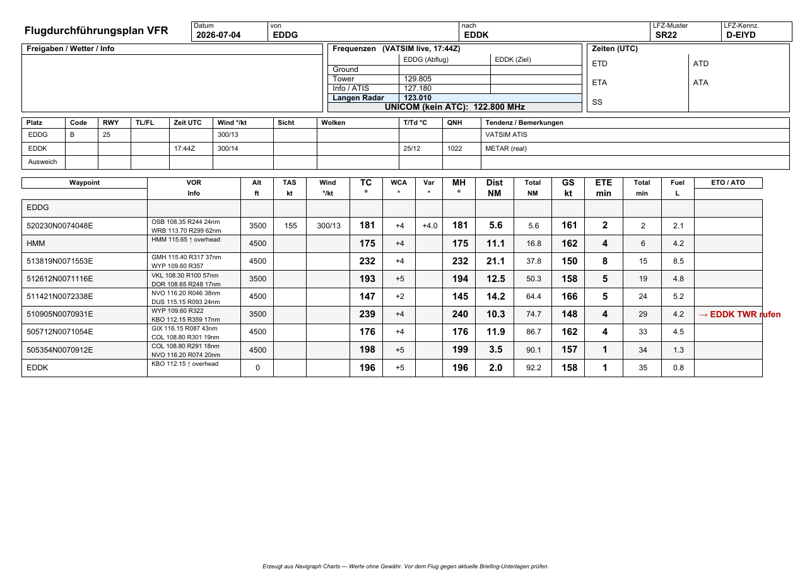
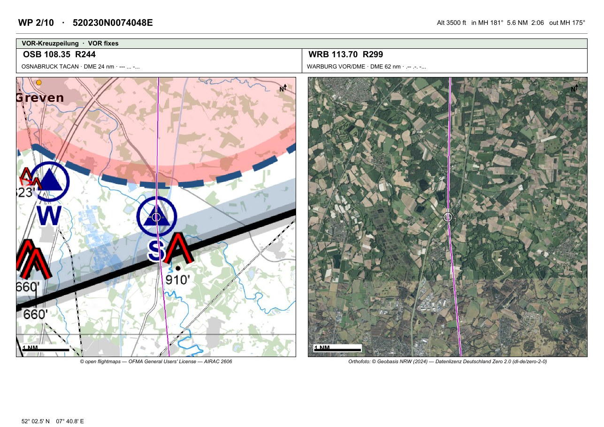
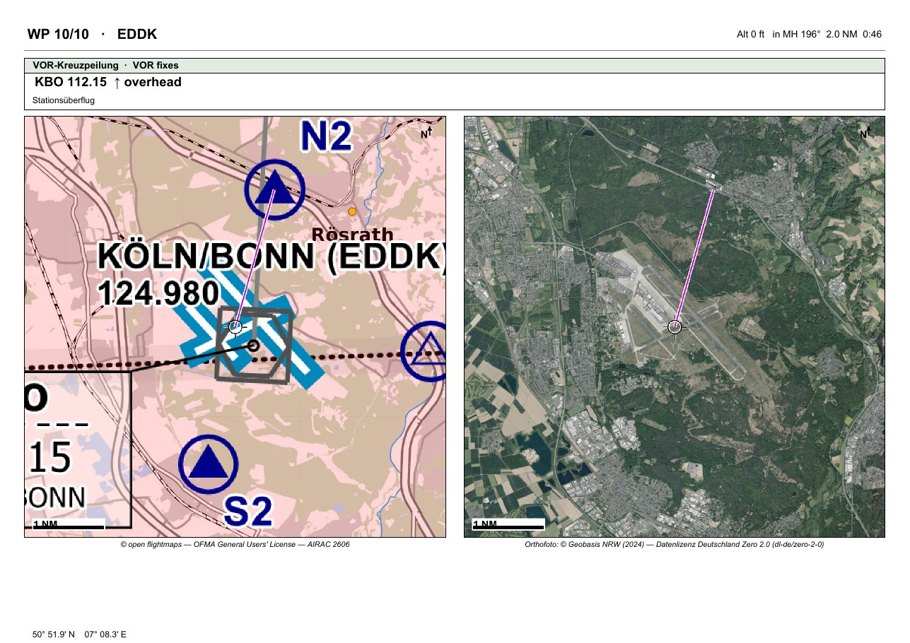
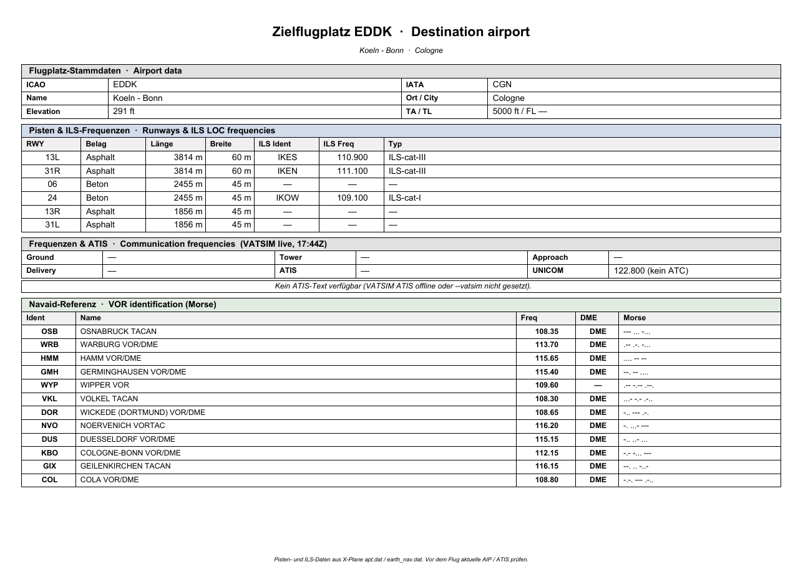
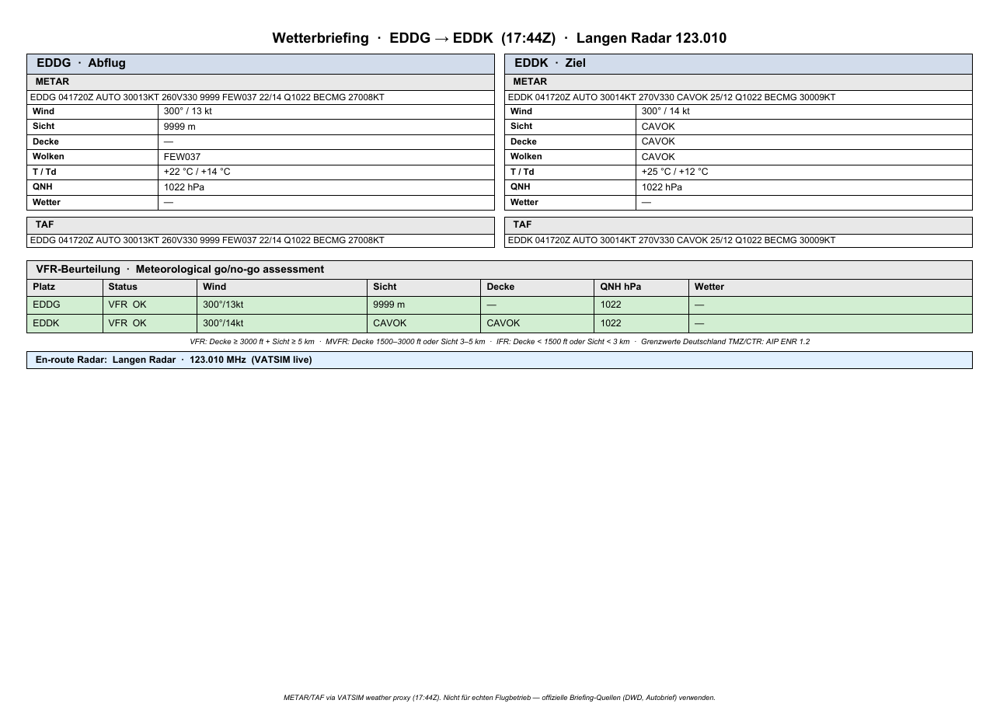
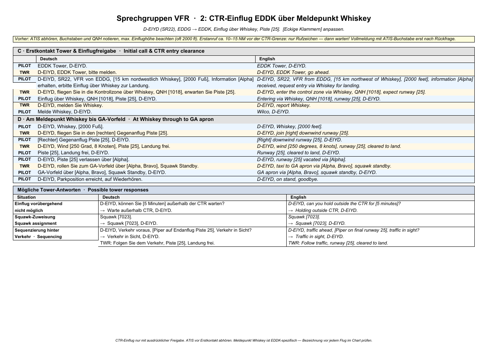

# vfr-navlog

A Python script that turns a VFR flight plan into a printable A4-landscape navlog PDF, German LBA-style. Built for simulator use with X-Plane 12 and VATSIM, but the output is real-world readable.

Two plan sources are supported:

- **[Navigraph Charts](https://navigraph.com/products/charts)** — the primary source. With `--navigraph`, the script reads the active plan directly out of Navigraph Charts' local storage on macOS. No export, no file — just plan and run.
- **[Little Navmap](https://www.littlenavmap.org/) `.lnmpln`** — pass the file with `--plan`. You can also plan in Navigraph Charts and export (File → Export → Little Navmap) to get this format.



## Output

All screenshots on this page come from one real run — EDDG → EDDK in an SR22, produced by the interactive session shown under [Interactive mode](#interactive-mode).

1. **Navlog** (above) — header strip, frequency block with live VATSIM frequencies (GND/TWR/ATIS/DEL/APP + en-route radar), ATIS strip, leg-by-leg table (TC / MH / dist / GS / ETE / fuel) with computed VOR cross-checks per waypoint, fuel summary, planning assumptions, tower-call marker.
2. **Waypoint briefing pages** (optional, `--wp-maps`) — one page per waypoint, chart and orthophoto side by side, with that waypoint's VOR radials. See [Waypoint map pages](#waypoint-map-pages-chart--orthophoto).
3. **FIS / Radar phraseology** — bilingual (DE/EN) dialogue cheat-sheet for the en-route FIS or radar contact. Adapts automatically: when Langen / Bremen / München Radar is online on VATSIM, the page title, note, and squawk guidance update to reflect radar service rather than basic FIS.
4. **CTR phraseology** — the full inbound sequence at the destination: initial tower call, full position report with ATIS letter, CTR entry clearance via Whiskey, Whiskey call, downwind join, landing clearance, runway vacated, taxi to GA apron. Variations table covers holds outside the CTR, squawk assignments, and traffic sequencing.
5. **Destination briefing** — airport data (elevation, TA/TL, IATA), runway table with ILS LOC frequencies from X-Plane's `earth_nav.dat`, communication frequencies, live VATSIM ATIS text, and a navaid reference table with Morse idents for every VOR used in the plan.
6. **Weather briefing** — two-column METAR + TAF for departure and destination (via VATSIM weather proxy), parsed key values (wind, visibility, ceiling, QNH, phenomena), VFR / MVFR / IFR go/no-go assessment table, en-route radar banner.

A waypoint briefing page mid-route — the chart carries the airspace, the orthophoto is what you actually see out the window, and the VOR band on top tells you which radials confirm you're there:



The destination waypoint page — Köln/Bonn's real runways in the photo, right under the chart's airport symbol, with the KBO overhead fix:



Destination and weather briefing:

<p>


</p>

## Install

Python 3.11+. The code lives in the `vfr_navlog` package; install it (editable is convenient for a personal checkout):

```
python3 -m venv .venv
source .venv/bin/activate
pip install -e '.[dev]'
```

`pip install -e '.'` pulls the runtime dependencies (`fpdf2`, `requests`, `img2pdf`) declared in `pyproject.toml`; the `[dev]` extra adds `pytest`, `pypdf`, and `ruff` for the test suite. If you prefer not to install the package, `pip install fpdf2 requests img2pdf Pillow` still covers the runtime.

Installing the package puts a `vfr-navlog` console script on your `PATH`. Both entry points are equivalent:

```
vfr-navlog --plan plan.lnmpln --aircraft aircraft_c172.json
python3 navlog.py --plan plan.lnmpln --aircraft aircraft_c172.json
```

`navlog.py` is a thin shim over `vfr_navlog.cli:main`, kept so the old `python3 navlog.py …` invocation keeps working. The examples below use `python3 navlog.py`; swap in `vfr-navlog` freely.

On macOS the tool registers `Arial.ttf` from `/System/Library/Fonts/Supplemental/` so umlauts render. On other platforms it falls back to core Helvetica.

### Tests

```
.venv/bin/pytest
```

Every network feature is stubbed or off in the tests — the suite makes no outbound calls.

### Navigraph Charts source (macOS only)

To read the active plan directly from Navigraph Charts, clone the Chromium local-storage reader next to `navlog.py`:

```
pip install brotli
pip install 'ccl_simplesnappy @ git+https://github.com/cclgroupltd/ccl_simplesnappy.git'
git clone --depth 1 https://github.com/cclgroupltd/ccl_chromium_reader.git
```

## Interactive mode

Run with no arguments and a wizard walks through everything. This is the actual session that generated the PDF in the screenshots above (lightly trimmed):

```
➜  vfr-navlog git:(main) python3 navlog.py

VFR Navlog  —  no arguments given, running interactive setup
Tab-completes file paths. Press Enter to accept [defaults].

Plan source
  [1]  Little Navmap .lnmpln file
  [2]  Navigraph Charts  (reads live from the app, macOS only)
  → [1]: 2
  Reading active Navigraph flight plan…[navigraph] EDDG to EDDK  (IFR)
  Loaded: EDDG → EDDK  (10 waypoints, cruise alt 38000 ft)

Aircraft JSON
  [1]  aircraft_c172.json  ← default
  [2]  aircraft_sr22.json
  → [aircraft_c172.json]: 2

Aircraft registration
  → [D-EXXX]: D-EIYD

Wind aloft  (DDD/SS, e.g. 270/15 — or 0/0 for calm)
  [M]  fetch surface wind from VATSIM METAR at EDDG
  → [0/0]: M
  EDDG 041720Z AUTO 30013KT 260V330 9999 FEW037 22/14 Q1022 BECMG 27008KT
  Using wind: 300/13  (surface METAR — not wind aloft)

Cruise altitude  (ft MSL)
  → [38000]: 3200

Altitude changes at waypoints  (optional)
  →

Magnetic variation  (e.g. 4E, 1.0W, -2.5)
  → [4E]:

VATSIM  (fetch live ATC frequencies?)
  → [y/N]: y

VOR-Kreuzpeilungen automatisch berechnen?  (aus X-Plane earth_nav.dat)
  Berechnet je Wegpunkt bis zu zwei VOR-Radiale zur Standlinien-Kontrolle.
  → [y/N]: y

VOR-Informationen je Wegpunkt manuell eingeben?  (z. B. 233 FROM)
  Enter je Wegpunkt übernimmt die berechnete Peilung; Freitext überschreibt sie.
  → [y/N]:

DFS airport charts  (append VFR charts for destination?)
  → [Y/n]:

Wegpunkt-Kartenseiten aus openflightmaps?  (je Wegpunkt ein Kartenausschnitt)
  Lädt Kartenkacheln beim ersten Lauf (Cache danach). Region Europa.
  → [y/N]: y
  Radius NM (1–5)  → [3]:
  Basiskarte je Seite: [1] Karte + Orthofoto  [2] nur Karte  [3] nur Foto
  → [1]:

X-Plane FMS export
  → [Y]:

ICAO FPL  (für my.vatsim.net Import)
  → Generieren? [y/N]:

[navigraph] EDDG to EDDK  (IFR)
[vor-fixes] 4016 VORs loaded, 16 cross-checks over 12 stations
[weather] fetching METAR/TAF for EDDG, EDDK…
[vatsim] EDDG: tower=129.805, atis=127.180
[vatsim] EDGG: radar=123.010
[weather] EDDG: VFR  ceiling=None ft  vis=9999 m  QNH=1022
[weather] EDDK: VFR  ceiling=None ft  vis=9999 m  QNH=1022
[hemispheric] Adjusted altitudes to comply with the VFR semi-circular rule:
  EDDG→520230N0074048E  MH 181° (W):  3,200 ft → 4,500 ft
  520230N0074048E→HMM  MH 175° (E):  3,200 ft → 3,500 ft
  HMM→513819N0071553E  MH 232° (W):  3,200 ft → 4,500 ft
  ...
  505354N0070912E→EDDK  MH 196° (W):  3,200 ft → 4,500 ft
[wp-maps] building chart + photo layers for 10 waypoint(s), AIRAC 2606…
Wrote /Users/spamies/Documents/Flight/Flightplans/EDDG-EDDK/navlog_2026-07-04_sr22.pdf
Total: 92.2 NM, 35 min, 35.5 L (trip only)
Wrote FMS  /Users/spamies/…/X-Plane 12/Output/FMS plans/EDDG-EDDK.fms
```

Worth noticing in that session: the plan came straight out of Navigraph Charts (no export step), the wind came from the live METAR with one keystroke, the naive 3 200 ft cruise was auto-corrected per leg to hemispheric-rule altitudes, and the VOR cross-checks — 16 radials over 12 stations — were computed from X-Plane's nav database without typing a single one.

The wizard also handles step climbs per waypoint, manual VOR free-text overrides, and ICAO FPL generation for VATSIM prefile (EOBT, POB, equipment, wake category — then opens `my.vatsim.net/pilots/flightplan/beta` pre-filled in your browser).

## CLI

```
python3 navlog.py \
    --plan "VFR Bielefeld to Muenster.lnmpln" \
    --aircraft aircraft_c172.json \
    --wind 270/15 \
    --magvar 4E \
    --cruise-alt 2500 \
    --vatsim \
    --dfs-charts \
    --fms \
    --fpl-eobt 1030 \
    --fpl-pob 2 \
    --output navlog.pdf
```

### Flags

| Flag | Default | Notes |
|------|---------|-------|
| `--plan` | — | Little Navmap `.lnmpln` file. Mutually exclusive with `--navigraph`. |
| `--navigraph` | off | Read the active plan live from Navigraph Charts (macOS). |
| `--aircraft` | required | JSON profile (see `aircraft_c172.json`). |
| `--registration` | from JSON | Override the aircraft registration for this run. |
| `--wind` | `0/0` | Wind aloft `DDD/SS`, e.g. `270/15`. Applied uniformly to every leg. |
| `--cruise-alt` | from plan | Override cruise altitude (feet MSL). |
| `--magvar` | `4E` | Magnetic variation. `4E`, `-3.5`, `2.5W` all work. |
| `--output` | auto | Output path. Defaults to `<dep>-<dest>/navlog_<date>_<type>.pdf`. |
| `--vatsim` | off | Fetch live VATSIM data: ATC frequencies, en-route radar, METAR/TAF. |
| `--dfs-charts` | off | Append VFR charts for the destination from the official DFS AIP. |
| `--vor-info` | off | Prompt for a free-text VOR reference (e.g. `233 FROM`) per waypoint; prints in the VOR column. |
| `--wp-maps` | off | Append one briefing page per waypoint with chart and orthophoto side by side. Needs network on the first run; tiles are cached. |
| `--map-radius-nm` | `3` | Map excerpt radius in NM (clamped 1–5). Only meaningful with `--wp-maps`. |
| `--map-base` | `both` | Which base layers per waypoint page: `both` (chart + photo), `chart`, or `photo`. Only meaningful with `--wp-maps`. |
| `--fms` | off | Write an X-Plane FMS v3 flight plan to `Output/FMS plans/`. |
| `--call-tower-nm` | `10` | NM remaining threshold for the tower-call leg marker. `0` disables. |
| `--xplane` | macOS Steam default | X-Plane 12 root. Pass `--xplane ""` to skip the destination-briefing page. |
| `--fpl-eobt` | — | Generate an ICAO FPL with this EOBT (HHMM UTC). Triggers FPL output. |
| `--fpl-pob` | `2` | Persons on board. |
| `--fpl-equipment` | `SDFG/C` | ICAO field 10 equipment/surveillance code. |
| `--fpl-wake` | `L` | Wake turbulence category (L / M / H / J). |
| `--fpl-alternate` | — | Alternate aerodrome ICAO. |
| `--fpl-pilot` | — | Pilot surname for FPL field 19C. |

## DFS airport charts

`dfs_charts.py` downloads VFR charts for any German airport from the official [DFS AIP](https://aip.dfs.de/) (Deutsche Flugsicherung), always at the current AIRAC cycle. No account or subscription needed.

```
python3 dfs_charts.py EDDV
python3 dfs_charts.py EDLI --no-ifr-aerodrome
python3 dfs_charts.py EDDV --out /tmp/charts
```

For each airport it fetches:

- **BasicVFR section** — VFR approach and area charts (the CTR entry/exit procedures, local traffic patterns, VFR routes into the airport)
- **BasicIFR aerodrome charts** — aerodrome chart (ICAO 2-5), ground movement charts (2-7, 2-7A), parking/docking chart (2-9), taxi restrictions (2-9A)

Output: individually numbered PNGs in `<ICAO>/` plus a combined `<ICAO>/<ICAO>_vfr_charts.pdf`.

When `--dfs-charts` is set (or selected in the TUI), `navlog.py` calls this logic internally and appends the chart pages to the navlog PDF. Each chart gets its own page, oriented portrait or landscape to match the source image.

The chart data comes from `aip.aero` as the AIRAC-cycle discovery index and `aip.dfs.de` for the actual pages. Both are public. Charts are embedded as PNG in DFS's HTML — the script extracts and reassembles them; there are no PDF originals to download.

## VATSIM integration

When `--vatsim` is set, the script makes three types of requests:

**ATC frequencies** — single GET against `https://data.vatsim.net/v3/vatsim-data.json`. Callsigns of the form `<ICAO>_GND`, `_TWR`, `_ATIS`, `_DEL`, `_APP`, `_CTR` are matched; split sectors (`EDDG_N_TWR`) handled by suffix. Frequencies populate the navlog's frequency block and the tower-call marker.

**En-route radar** — the script detects which German FIR the route overflies (EDGG Langen, EDWW Bremen, EDMM München) from waypoint latitudes and looks for online CTR stations. If Langen Radar is online, its frequency appears in a dedicated row in the frequency block (highlighted in blue) and the phraseology page 2 title and note update to reflect radar service, including the correct squawk guidance.

**Weather** — METAR and TAF for departure and destination via `metar.vatsim.net`. Results appear on the weather briefing page (page 5) with parsed wind, visibility, ceiling, temperature, QNH, and a VFR / MVFR / IFR assessment. Neither page is generated nor any request is made if `--vatsim` is off.

All network calls fail soft — if a request times out or returns an error, the corresponding cells stay blank and the script continues.

## ICAO FPL export

The script generates an ICAO ATS message ready for import into `my.vatsim.net/pilots/flightplan/beta`:

```
(FPL-DEXXX-VG
-C172/L-SDFG/C
-EDLI1030
-N0107A025 DCT OSN DCT
-EDDG0022 EDLP
-DOF/260529 REG/DEXXX
-E/0602 P/002 R/UV S/- J/-)
```

Key points:
- Altitude is ICAO `Axxx` format (hundreds of feet) — `A025` for 2500 ft. `VFR` as a level token is not accepted by the parser.
- Coordinate waypoints (e.g. `521430N0075330E` from user-defined points) are stripped from the route; only named fixes are kept.
- Aircraft type uses the `icao_type` field from the aircraft JSON when present (e.g. `C172`, not `C172S` which is the model name, not the Doc 8643 designator).
- On macOS, the script builds the pre-fill URL and opens `my.vatsim.net/pilots/flightplan/beta?raw=…` directly in your browser. The form arrives ready to file.
- The `.fpl` file is also saved next to the PDF.

## Aircraft profile

Edit `aircraft_c172.json` or write your own. The script reads:

| Field | Purpose |
|-------|---------|
| `type` | Displayed in the PDF header and phraseology pages |
| `icao_type` | ICAO Doc 8643 designator used in the FPL (overrides `type`). Set when the two differ, e.g. `C172S` → `C172`. |
| `registration` | Default registration; overridable via `--registration` or TUI |
| `performance.tas_cruise` | kt — navlog math |
| `performance.fuel_burn_cruise_lph` | cruise burn for fuel summary and endurance |
| `performance.fuel_burn_climb_lph` | climb burn |
| `performance.fuel_burn_taxi_lph` | taxi burn |
| `fuel.capacity_usable_l` | usable fuel for endurance calculation |
| `fuel.reserve_minutes` | reserve bucket |
| `fuel.taxi_minutes` | taxi bucket |
| `fuel.approach_minutes` | approach/circuit bucket |
| `fuel.alternate_minutes` | alternate bucket (0 = none planned) |

`mass_balance` is parsed but not yet rendered — present for future W&B expansion.

The bundled `aircraft_c172.json` uses Cessna 172S POH-typical numbers at 65% power. **Verify against your aircraft's POH before flying.**

## Phraseology pages

Both pages are templated to the registration, aircraft type, departure, and destination from the plan.



**Page 2 — FIS / en-route Radar.** When `--vatsim` is active and a radar station is online (e.g. Langen Radar), the page title shows the station name and live frequency, and the note box explains radar service semantics — squawk as instructed, separation is possible. When no radar is online it falls back to the standard Bremen Information FIS dialogue (Erstanruf, Vollmeldung, squawk 7000 on departure, workload denial and no-radar-contact variations).

**Page 3 — CTR entry via Whiskey.** EDDG-specific. The reporting-point name "Whiskey" and the assumed entry runway must be verified against current charts before each flight. The tower frequency in the subtitle is populated live from VATSIM when available.

## Destination briefing

Reads from X-Plane's local nav data — no internet, no scraping:

- `apt.dat` — elevation, transition altitude/level, IATA, runway endpoints / width / surface. Runway length is great-circle between endpoints.
- `earth_nav.dat` — ILS LOC entries (type 4/5) joined to runways.

Degrades gracefully if the X-Plane files aren't found: comm frequencies and ATIS still appear, runway/ILS sections note the missing data.

## Waypoint map pages (chart + orthophoto)

With `--wp-maps`, the PDF gains one landscape briefing page per waypoint, in route order, directly after the nav table. Each page shows **two maps side by side of the same square, same scale**: the openflightmaps chart on the left for airspace and navaids, a photograph on the right for recognition — what the place actually looks like out the window.

- **Both maps** are centred on the waypoint at the same radius (`--map-radius-nm`, default 3, clamped 1–5) and carry the same marker at the crosshair, the route line drawn through it (magenta, white-haloed so it survives both the pink airspace tint and a dark orthophoto), a 1 NM scale bar, and a north hint. The aero overlay is on the chart only; the photo stays clean, which is the whole point of having it.
- **The VOR band** under the header repeats that waypoint's cross-checks (ident, frequency, radial, DME, Morse) laid out horizontally. It collapses entirely when the waypoint has no fixes, giving the maps the full height. A manual `--vor-info` entry overrides the computed fixes, same precedence as the table. The waypoint's position in degrees-minutes sits along the page bottom for the GPS cross-check.
- **`--map-base both|chart|photo`** (default `both`) picks which halves to draw. `chart` reproduces the old chart-only page full width and never touches the photo endpoints; `photo` does the reverse. If one layer is missing for a given waypoint (no photo coverage, say), that page degrades to the other layer full width; if neither is available, the page is skipped.

### Base layers

The **chart** is the openflightmaps composite: an opaque JPEG ground layer (z12) with a transparent aero overlay (z11, upscaled ×2), from the public slippy-tile API (`nwy-tiles-api.prod.newaydata.com`). The AIRAC cycle is computed from the date; on a publication-lag 404 the run falls back to the previous cycle once. Cached under `~/.cache/vfr-navlog/ofm/{cycle}/…`.

The **photo** comes from a cascade, best resolution first:

| Provider | Coverage | Resolution | License / attribution line |
|----------|----------|-----------|----------------------------|
| Niedersachsen DOP20 (WMS) | Lower Saxony | 20 cm | `Orthofoto: LGLN (2024) Creative Commons Namensnennung – 4.0 International (CC BY 4.0)` |
| Nordrhein-Westfalen DOP (WMS) | North Rhine-Westphalia | 20 cm | `Orthofoto: © Geobasis NRW (2024) — Datenlizenz Deutschland Zero 2.0 (dl-de/zero-2-0)` |
| Sentinel-2 cloudless (EOX, WMTS) | Europe-wide | 10 m | `Sentinel-2 cloudless - https://s2maps.eu by EOX IT Services GmbH (Contains modified Copernicus Sentinel data 2024)` |

Routing is by a rough coverage rectangle per state: a waypoint inside one is served by that state's DOP, everything else falls to Sentinel-2. State WMS servers answer *outside* their real data with white fill — fully blank when the whole bbox is off-state, partially filled when the bbox straddles the border (imagery on their side, white on the other). Both are detected (near-uniform, or more than ~25% near-white pixels) and rejected, so the cascade continues and a border waypoint like Minden gets the neighbouring state's full photo instead of a half-empty one. DOP GetMap responses are cached under `~/.cache/vfr-navlog/dop/` keyed by rounded bbox and size; Sentinel-2 tiles under `~/.cache/vfr-navlog/s2/{layer}/{z}/{x}/{y}.jpg`. This imagery is not AIRAC-bound, so the cache is capped at ~1 year by modification time rather than a cycle key. Fetches are capped at four concurrent per host, 10 s timeout each; any failure yields None and degrades, never a failed PDF.

The DOP20 licence strings above were verified live against each service's `GetCapabilities` on 2026-07-04. The DFS official ICAO 1:500,000 chart is **not** usable here — it lives only behind the login-protected AIS portal (secais.dfs.de); DFS's public geodata service is air-transport-network *vectors*, not the raster chart. The openflightmaps aero rendering is the closest legitimately usable public equivalent.

**Attribution.** openflightmaps data is published under the [OFMA General Users' License](https://www.openflightmaps.org/) — free use with attribution. Every chart carries `© open flightmaps — OFMA General Users' License — AIRAC {cycle}`; every photo carries its provider's licence line verbatim, as a caption directly under the map. The EOX imagery is CC BY-NC-SA 4.0 — fine for this personal, non-redistributing tool.

## Tower-call marker

The script walks legs forward. The first leg whose end sits within `--call-tower-nm` of the destination is the call leg; the marker anchors at its start so the cue appears early enough to dial in the radio. If VATSIM has Tower online, the marker shows the live frequency (`→ TWR 129.805`); falls back to APP if only Approach is up, or `→ EDDG TWR rufen` if neither.

## X-Plane FMS export

With `--fms`, writes a version-3 FMS file to:

```
<xplane-root>/Output/FMS plans/<DEP>-<DEST>.fms
```

Type codes: `1` = airport, `3` = VOR, `2` = NDB, `11` = intersection, `28` = user waypoint. Load before connecting to VATSIM.

## Limitations

- Single wind aloft, applied uniformly. No per-leg wind, gradient, or forecast parsing.
- No mass & balance or performance calculation beyond fuel.
- Magnetic variation is a single constant — fine for Germany, less accurate over large gradients.
- No MORA lookup.
- FIR detection for en-route radar is latitude-based only — coarse, works for German routes.
- Phraseology pages are tailored to the EDLI→EDDG route (Bremen/Langen FIS, Whiskey VRP at EDDG). Adapt for other routes.
- DFS chart download (`--dfs-charts`) only covers German airports (ED prefix). Non-German destinations are silently skipped.
- Waypoint map pages (`--wp-maps`) depend on public map services (openflightmaps tiles, state DOP WMS, EOX Sentinel-2 WMTS), none with an SLA. State reorganizations can drift a WMS endpoint; each provider fails gracefully to the next or to a skipped page. State orthophoto coverage is currently Niedersachsen and Nordrhein-Westfalen only; everywhere else uses the 10 m Sentinel-2 photo.

## License

MIT. See `LICENSE`.
